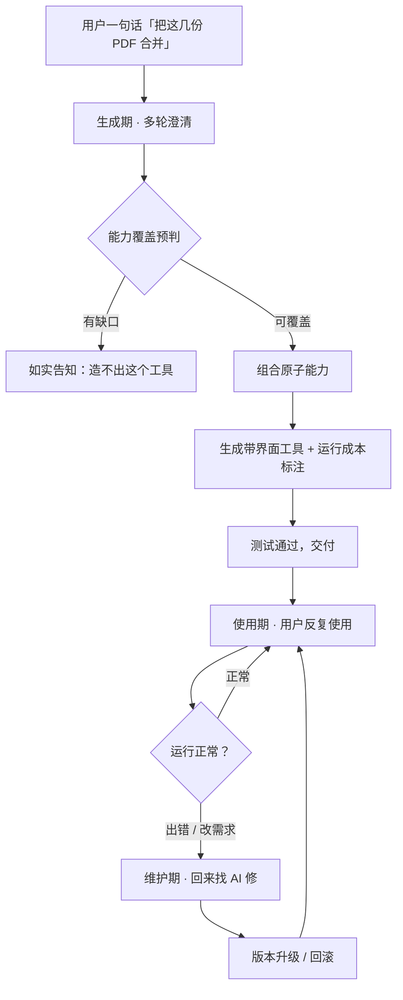
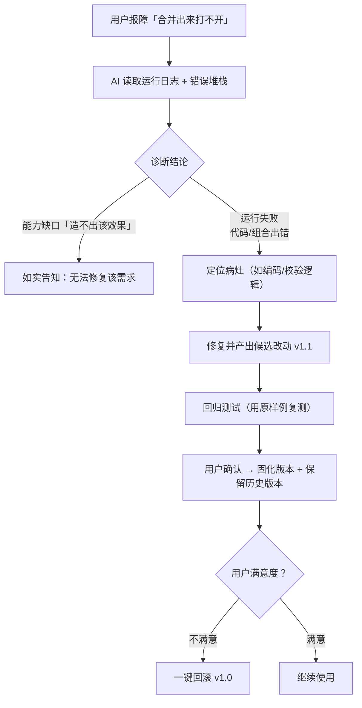

# 小班 · 让 AI 帮你打造属于自己的工具箱 · PRD

> Product Requirements Document · V1.1

**小班** —— 让 AI 帮你打造属于自己的工具箱：应用自身只有一组「原子能力」积木；用户一句话，AI 连续追问澄清后，把原子能力组合成一个**带界面、可反复使用、可版本回溯的本地工具**；工具出问题或要改需求时，再回来找应用内的 AI 维护。

| 项目 | 内容 |
| --- | --- |
| 版本 | V1.1（小班） |
| 日期 | 2026-08-23 |
| 状态 | 待评审 |
| 类型 | 0-to-1 · 重型 |
| 平台 | macOS / Windows |

**目录**

- 01 需求背景
- 02 需求目标
- 03 市场与竞品分析
- 04 用户故事
- 05 术语表
- 06 功能需求详情
- 07 AI 产品专项
- 08 实现层与界面隔离
  - 8.7 工具 git 管理
- ＋ 参考来源

---

## 01 需求背景

### 1.1 业务触发

AI 已经走过了「聊天问答」与「一次性任务执行」两个阶段。用户发现：让 AI 代跑一次任务确实爽，但**下一次同样的事还得重新说一遍**——「把这三份 PDF 合并」「再把这五份 PDF 合并」，每次都是新一轮对话、重新确认生成。真正打动普通用户（非开发者）的，是**把常用的一件事沉淀成一个可以反复打开就用的「工具」**，而不是每次重来。

于是产品的核心命题变成了：**应用本身只有一组「原子能力」积木，不预置任何成品功能**。用户的每一次个性化需求，都由 AI 就地「生成一个工具」来交付。工具生成过程中，AI 会连续不断地追问澄清，直到需求被完全锁死；工具交付后，用户按自己的节奏反复使用；只有当工具要改需求、或运行出了问题时才回来找应用内的 AI 维护。

### 1.2 与「任务执行器」的本质区别

市面上大多数 agent 走的是**任务执行器**路线：一句话 → 生成代码 → 跑一次 → 交付结果 → 结束。本产品走的是**工具工厂**路线，交付物不是「一次结果」，而是「一个可反复使用的工具」。两者在交付物、使用方式、AI 参与度上截然不同：

| 维度 | 任务执行器（多数 agent） | 工具工厂（本产品） |
| --- | --- | --- |
| 交付物 | 一次性的执行结果 | 一个带界面、可反复使用的本地工具 |
| 用户习惯 | 每次都要对新任务重新描述、重新确认 | 一次生成，长期打开即用 |
| AI 参与度 | 任务期间全程在线，结束后退出 | 生成期/维护期在线，使用期基本离线 |
| 需求变更 | 重新发一个新任务 | 回来找 AI 改需求 → 确认固化新版本 → 可回滚 |
| 可复用性 | 代码/会话难复用 | 工具是第一等公民，进入工具仓库长期留存 |

### 1.3 用户痛点（具体场景）

- **痛点 A · 重复劳动，反复重来**：财务同事每周都要「把某文件夹里所有 PDF 的第 3 页抽出来合并成一个新 PDF」。用对话式 AI，她每周都要把同样的需求重新说一遍、重新确认生成、重新试错。
- **痛点 B · 一句话说不清真正想要的**：「把 PDF 合并一下」太模糊：输出命名规则？页码范围？是否去重？需要 AI 主动追问澄清，而不是替用户做一堆想当然的假设。
- **痛点 C · 工具坏了没人管**：一次性生成的脚本，换个文件格式就报错。用户不知道该找谁、也不知道怎么描述问题，只能放弃重来，之前的投入全部浪费。
- **痛点 D · 运行成本反直觉**：用户不知道这个工具跑一次是否要联网、是否消耗 token。一个「合并 PDF」的本地操作不该偷偷调远程大模型。

### 1.4 产品主链路：一句话 → 工具

**图 1 · 工具生命周期主链路（生成期 → 使用期 → 维护期 闭环）**



**关键点**：生成期与维护期是「AI + 用户」共同参与的慢过程；使用期是「用户自己」独享的快过程，此时 AI 是否介入完全由工具的原子能力底层实现决定。

---

## 02 需求目标

### 2.1 定性目标

本产品的目标是让普通用户**用一句话「攒」出一个属于自己的本地小工具**，并且这个工具能长期稳定地为他服务。围绕「工具是交付物」的核心，定性目标拆分为：

- **目标 1 · 生成就该「一次到位」**：生成期通过连续追问澄清 + 能力覆盖预判，避免生成一个「似乎能用但细节全错」的工具；能做的直接做对，做不了的如实告知。
- **目标 2 · 使用期「脱 AI 也能跑」**：工具交付后有清晰的界面、明确的输入输出与运行成本标注；用户靠界面就能完成操作，不依赖每轮都对话。
- **目标 3 · 维护期「坏得起、改得动」**：工具出问题或需求变化时，用户能低成本地让 AI 修复并产出候选改动，确认后固化新版本；改坏了能一键回滚，不丢历史。
- **目标 4 · 成本「看得见」**：每个原子能力标注是否联网 / 是否消耗 token，工具界面明示「跑一次大概花多少」，用户使用前有预期。

### 2.2 成功指标（尽可能量化）

| 指标 | 目标值 | 含义 |
| --- | --- | --- |
| 生成期首次交付即通过用户验收 | ≥ 70% | 首次交付即被用户接受 |
| 生成期平均追问澄清轮数 | ≤ 5 轮 | 澄清是否过于啰嗦 |
| 工具 7 天内被复用的比例 | ≥ 40% | 工具是否真的好用 |
| 用户描述一次修复问题的耗时 | < 5 min | 维护期的用户成本 |

> 注：这些是 MVP 上线后需要埋点验证的「北极星式」指标，用于反推生成期澄清策略是否过于啰嗦、工具是否真的好用。

### 2.3 MVP 范围（聚焦核心闭环）

MVP 只打通「一句话 → 生成一个带界面的本地工具 → 反复使用 → 回来修 → 版本升级/回滚」这条最小闭环，刻意砍掉平台化、生态化能力：

**MVP 必做**

- 原子能力注册表 + 覆盖预判
- 多轮澄清对话引擎
- 带界面的工具生成（表单/文件入参）
- 运行成本 / 联网依赖标注
- 工具仓库 + 版本 / 回滚
- 维护期问题诊断 + 修复

**MVP 不做**

- 任意用户自定义新原子能力
- 跨设备工具同步 / 社区工具市场
- 多用户协作编辑工具
- 复杂可视化编排画布
- 第三方插件 / MCP 生态对接

**非目标**

- 不做通用代码编辑器 / IDE
- 不做「一次任务」的一次性执行平台
- 不让 AI 绕过原子能力边界做越权操作
- 不替代专业工具（如完整 PDF 套件、Photoshop）

---

## 03 市场与竞品分析

### 3.1 核心问题：市场存在吗？

本产品的差异化不在「用 AI 生成代码」，而在**「一句话生成一个可持续使用的本地工具」这个具体交付物**。要验证机会，需同时满足六个条件：一句话生成 / 本机桌面 / 带界面 / 可反复使用 / 版本回溯 / 运行成本透明。其中「运行免 LLM」并非产品级承诺，而是**能力级属性**（见 8.5）——仅当工具组合的全是 offline 原子能力时才真正离线。调研 2026 年主流产品后判断：**尚无产品同时满足全部六个条件**，存在明确的空白带。

### 3.2 竞品分类对比

| 类别 | 代表产品 | 一句话生成 | 本机桌面 | 带界面 | 可反复用 | 版本回溯 | 运行免 LLM |
| --- | --- | --- | --- | --- | --- | --- | --- |
| Web 应用生成器 | Lovable / Bolt.new / v0 / Replit Agent | ✅ | ❌ 网页托管 | ✅ | ✅ | ✅ Git | ✅ |
| 自定义助手 | OpenAI GPTs / Claude Projects + Skills | ✅ | ❌ 云端对话 | ❌ 无独立 UI | △ 会话内复用 | ❌ | ❌ 每次调 LLM |
| 桌面自动化 | Apple Shortcuts / Raycast / Alfred | △ 个别支持 | ✅ 原生本机 | ✅ | ✅ | ❌ 版本弱 | ✅ |
| 工作流构建器 | n8n / Zapier / Dify | ❌ 需拖拽 | △ 自托管 | ✅ | ✅ | ✅ | △ 视节点 |
| 任务执行 agent | Claude Cowork / Claude Code / Codex CLI / Cursor | ✅ | ✅ 本地 | △ 终端/副驾 | ❌ 一次性 | △ 弱 | ❌ 每次调 LLM |
| **本产品** | 小班（工具工厂式桌面助手） | ✅ | ✅ 原生 | ✅ | ✅ | ✅ | ✅ |

### 3.3 四维能力对比

**图 2 · 竞品在「一句话生成 / 本机桌面 / 版本回溯 / 运行免 LLM」四维上的占比对比（越满越接近本产品定位）**

> （对应原文档中的雷达图，此处省略为文字标识）

从上图可见：Web 生成器在「运行免 LLM + 版本回溯」领先但非本机桌面；桌面自动化本机 + 免 LLM 但版本回溯弱、一句话生成不完全；任务 agent 能一句话 + 本机，但依赖 LLM 且一次性。横轴钻出了「六项全占」的空白。

### 3.4 差异化与机会点

- **机会 1 · 本机 + 成本透明的运行期**：工具在「使用期」可完全脱离在线大模型运行（当组合的全部原子能力均为 offline / 本机能力时），既省钱又离线可用，这是 Web 生成器和云端助手给不了的；一旦组合到 online 能力，则如实标注联网 / 耗 token（见 8.5）。
- **机会 2 · 把「工具」当第一等公民**：有名称、输入、输出、界面、版本、运行记录，纳入工具仓库长期管理，配合版本回溯形成资产沉淀，而不是「用完即弃」的聊天会话。工具**仅存在于应用内**，构成用户个人的工具集合，不做导出 / 移植。
- **机会 3 · 明确的原子能力边界**：AI 只能组合「已定义的能力」，造不出就如实说。这既保证安全（不会越权乱跑），也让「能力缺口 vs 运行失败」可被诚实地区分。
- **机会 4 · 维护期的自愈闭环**：普通用户面对「工具坏了」不再无助；一句「它报错了」就能触发诊断、定位、修复、升级版本，甚至一键回滚。

---

## 04 用户故事

### 4.1 目标用户画像

- **第一用户 · 早期种子（开发者本人）**：本产品早期以开发者（含产品作者本人）为第一用户，先以**开发者视角**跑通全流程，直接暴露分支、commit、tag 等 git 底层概念，用于快速打磨与验证。**这是产品的演化起点，不是最终定位。**
- **主画像 · 效率型白领**：常见于财务、运营、行政、HR。会装 app、会用快捷键，但不会写代码、不碰终端。痛点：大量重复的文档/表格/图片处理，日复一日。**产品成熟后转为面向这类用户，届时将 git 底层封装为友好的「版本 / 回滚」叙事。**
- **次画像 · 轻度创作者**：设计、自媒体、研究助理。需要批量修图、批量改格式、定时抓取再汇总。有过「找 AI 生成脚本但跑不起来」的经历。
- **演化路径**：先「开发者视角、全面暴露分支」跑通，再「封装版本、面向普通用户」。两者只差一层 UI 包装，底层 git 模型一致（见 6.6 / 8.7）。

### 4.2 生成期用户故事

**故事 · 生成期：一句话攒一个「PDF 合并工具」**（AI + 用户）

> 运营小林对应用说：「我想把几个 PDF 文件合并在一起。」应用内的 AI 没有急着动手，而是先连续追问，把模糊需求锁死：

- **用户**：我想把几个 PDF 文件合并在一起
- **AI**：好的，我会帮你做一个「PDF 合并工具」。先确认几点：
  - **Q1** 合并后是按你选择的文件顺序，还是按文件名排序？
- **用户**：按我拖进来的顺序就行
- **AI**：**Q2** 合并方式：是把多个文件直接拼成一个，还是要抽取指定页？
- **用户**：直接整个拼起来
- **AI**：**Q3** 是否需要拆分后重新命名 / 去重？（如不需要，我就按「整本拼接 + 输出文件名」生成）
- **用户**：不需要，直接拼
- **AI**：已确认，足够清晰了。正在检查能力覆盖…
- **AI**：能力覆盖判定：「合并 PDF」需要「本地文件读取」+「PDF 结构解析」+「PDF 写入导出」三项原子能力，均可用 → 可生成。
- **AI**：✅ 已生成工具「PDF 合并器」× 界面：拖入文件 → 点击合并 → 输出路径选择。跑一次为纯本地操作，不联网、不耗 token。

**验收标准**：生成后给用户一个预览界面，用户能直观看到「默认输出命名规则」「是否联网」等关键决策，再点确认。若默认假设不合意，可一句「改一下命名」进入维护期。

### 4.3 使用期用户故事

**故事 · 使用期：每周静静用它，和 AI 无关**（用户自己）

> 接下来的每周五，小林都直接打开「PDF 合并器」工具页：把本星期的几份 PDF 拖进窗口，点一下「合并」，输出到指定文件夹。全过程只有几秒，**没有任何对话框、不需要联网**。工具界面右上角常驻一行小字：**运行成本：本机操作 · 联网 无 · 预估耗时 < 5s**。

**工具运行视图示意**

```
PDF 合并器 · v1.0
输入：多份 PDF 输出：单份 PDF
免联网 免 token
最近运行：2026-08-21 17:32 · 成功 · 耗时 2.1s · 输出 3 个文件
```

**成本透明说明**：为什么工具能「免联网」？因为「合并 PDF」组合到的三个原子能力（文件读取、PDF 解析、PDF 写入）都是本机绑定能力。工具生成时会**自动追踪每个原子能力的底层实现**，并把「联网/耗 token/本地」叠加成工具级标注，透传给用户。

**验收标准**：用户在使用期内可完全离线、零对话完成 > 95% 的操作；工具页明示运行成本与最近运行记录；若某原子能力需要联网/耗 token，工具必须提前显示，而不是运行时才弹提示。

### 4.4 维护期用户故事

**故事 · 维护期：工具坏了 / 要改需求 → 回来找 AI**（AI + 用户）

> 某周五，小林合并时一直报错：「合并后文件打不开」。她点进工具的「找 AI 修」，一句：「合并出来打不开了，报错说格式不对。」这一次「找 AI 修」就是一次任务——AI 基于工具的运行记录与报错日志，先判定这是「可修复的运行失败」而非「能力缺口」，然后定位、修复、产出候选改动。小林查看改动后确认保留，固化为 v1.1，v1.0 仍可回滚。

**图 3 · 维护期修复分支：能力缺口 vs 可修复的判定**



**验收标准**：维护期修复后能自动回归测试通过；「能力缺口」与「运行失败」必须被明确区分并如实反馈；是否产出版本、产几个由用户从任务产出中决定；用户可一键回到任意历史版本。

---

## 05 术语表

| 术语 | 定义 | 关键属性 |
| --- | --- | --- |
| 原子能力 | 应用内预先定义的最小可执行操作单元，是 AI 能组合的全部「材料」。例：本地文件读取、PDF 结构解析、PDF 写入、网页搜索、定时任务、通知。 | 有统一契约（见 8.1）：输入/输出 schema、副作用级别 sideEffect、运行域 runtime（frontend / backend）、成本属性 cost（offline / online）、检索元数据 scenario |
| 工具 | 本产品的交付物：由若干原子能力组合而成、带界面、可反复使用的本地应用。**仅存在本应用内部，不支持导出 / 移植**。是第一等公民，有名称、输入、输出、界面、版本、运行记录。每个工具对应一个独立 git 仓库。 | 唯一标识、版本历史、成本标注、副作用汇总、仅应用内运行 |
| 任务 | 一次与某工具绑定的变更工作单元（创建 / 改需求 / 修复 / 实验等）。一个工具对应多次任务；任务在工具所属 git 仓库的分支上工作，AI 的每次 commit 只是过程记录，**不等于正式版本**。 | 1 工具 : n 任务；任务（怎么做的过程）与版本（保留哪些成果）解耦；是否产出版本、产几个由用户决定 |
| 工具执行进程 | 承载 AI 编排的后端调用逻辑（顺序/分支/参数）的 utilityProcess，它再调用各 backend 能力。工具 = 前端 WebContentsView + 一条工具执行进程。 | 与操作能力一样进程隔离，只见登记能力 |
| 工具生成 | 「一句话 → 工具」的过程。包含多轮澄清、能力覆盖预判、组合原子能力、生成界面、测试交付。 | 由 AI + 用户共同完成 |
| 生命周期三阶段 | 生成期（AI+用户，慢过程）→ 使用期（用户自己，快过程）→ 维护期（AI+用户，再慢过程）。 | 决定 AI 参与度与运行成本来源 |
| 工具仓库 | 管理单个用户在其应用实例内积累的所有已生成工具的界面/数据结构，工具以标签页并排打开，每个工具页内展示该工具的会话历史、版本、最近运行记录。**工具不可移植出应用**，仓库随用户本机档案留存。 | 按用户隔离；标签页并排打开；工具页内会话历史管理多次变更、查看版本与运行记录、回滚 |
| 个人工具集合 | 每个用户在自己的应用里，通过 AI 不断创建、积累并管理的全部工具的总和，构成用户的个人数字资产。 | 随账号 / 本机档案留存；不跨用户共享；不做导出 / 交换设计 |
| 工具界面 | 工具交付后用户实际交互的 UI，由生成期根据工具输入输出自动生成（表单 / 文件拖拽 / 参数选择 / 结果预览）。 | 必须响应式、明示成本与副作用 |
| 运行成本 / 联网依赖 | 工具每次运行是否联网、是否消耗 token/预算、预估耗时。由组合到的原子能力底层实现叠加得出。 | 使用前展示，用于「成本看得见」 |
| 能力覆盖 | 判断「用户需求能否用现有原子能力组合实现」的预判打分。 | 可覆盖 → 生成；不可覆盖 → 如实报告 |
| 能力缺口 | 现有原子能力无法满足用户的某些需求。此时「造不出工具」，属于产品边界，不是 bug。 | 如实告知 + 给出可近似方案或欠缺的能力清单 |
| 运行失败 | 工具「能造出来」但运行时报错，属代码/组合问题，进入修复循环。 | 与能力缺口必须二分处理 |
| 自愈 | 工具出错时由 AI 自动诊断、定位、修复，产出候选改动的行为。是否固化为正式版本由用户决定；改动可回滚。 | 维护期核心能力 |
| 版本 / 回滚 | 一个工具 = 一个独立 git 仓库；版本 = 仓库中**经用户确认固化的正式 commit/tag**（用户可从任务产出中选多个、或合成一个，也可不固化）。回滚 = 切到某历史 commit/tag。 | 每工具一个 git 仓库；正式版本 = 用户从任务产出中选定的 commit/tag |
| 副作用分级 | 按原子能力对系统/数据的影响分级：read（只读）→ write（写文件）→ notify（通知/联网）→ destructive（删除/覆盖/不可逆）。 | 决定用户在生成期/运行期需要何种确认 |

---

## 06 功能需求详情

本章是核心章节，按生命周期三阶段组织为 6 个模块。每个模块按「需求描述 → 界面 / 交互原型 → 验收标准」展开，并配可切换的演示，帮助评审直观理解。

### 6.1 模块一 · 生成期：意图理解与多轮澄清

用户一句话往往模糊，AI 需在动手前**连续追问澄清**，直到能唯一确定工具的行为，避免「貌似能用但细节全错」。追问应提问式、可跳过、可一键采用建议默认值。

**生成期 · 意图澄清对话**

1. **澄清策略：优先级排序**（影响输出结果的先问：排序/范围/命名）；次要项（颜色/字体）用建议默认值带过。
2. **可跳过**：用户可一句「按你默认的来」，AI 必须给出默认假设并允许之后改。
3. **终止**：若用户 3 次表示「就按默认」，AI 结束澄清进入能力覆盖判断。

**验收标准**：澄清轮数 ≤ 5；所有可能影响结果的歧义必须在生成前被问到或明确跳过；用户可随时插入「重新说」。

### 6.2 模块二 · 生成期：能力覆盖预判

澄清完成后，AI 先**预判能否用现有原子能力组合实现需求**，再决定进入生成流程还是如实报告「能力缺口」。这是一次诚实的「可行性检查」，杜绝「硬造」。AI 把用户意图映射到各能力的 `scenario` 检索元数据，命中确定的能力 id，保证覆盖预判与技术选型是**确定性**的而非靠语感。

**生成期 · 能力覆盖预判**

- 所需原子能力
- 预判结论

**验收标准**：预判结论必须在生成前展示并可解释；「不可覆盖」直接用 fail-banner 如实告知，并列出缺失能力清单与可近似方案；禁止进入死循环尝试。

### 6.3 模块三 · 生成期：工具组装与界面生成

覆盖通过后，AI 将原子能力按依赖顺序**组装成工具**，并自动生成带界面的操作 UI。组装计划要对用户可视化，让用户看得懂「这个工具包含哪些能力、按什么顺序执行」。工具界面 = 受控宿主（WebContentsView）里对**注入白名单组件**的编排——AI 只决定布局与调用，不手搓组件（见 8.4）。

**生成期 · 工具组装与界面预览**

- 组装计划
- 工具界面预览

**验收标准**：工具界面必须由工具输入/输出 schema 自动推导生成；展示「联网/耗 token」成本标注；生成后先本地回归测试再交付；用户可见组装全过程。

### 6.4 模块四 · 使用期：工具运行与成本透明

使用期是用户独立体验阶段。关键要求是**运行成本/联网依赖透明**：工具必须预先告知「跑一次要不要联网、要不要耗 token、耗时多少」。是否调用 LLM 完全由原子能力契约的 `cost` 字段决定（offline / online，见 8.5），工具级标注 = 组合到原子能力 cost 的叠加；这不是产品级承诺，而是每个原子能力的固有属性。

**使用期 · 运行成本对比**

- **规则 1 · 成本来自底层能力**：「合并 PDF」全链本机 → 免联网；「把音频转成文字摘要」会调用语音识别 + 大模型 → 联网 + 耗 token。工具把这些原子能力的属性叠加后再展示给用户。
- **规则 2 · 运行记录可追踪**：每次运行记录耗时、成功/失败、输出、是否联网，用于使用期排查与维护期诊断。

**验收标准**：工具在使用前明确展示「联网/耗 token/预估耗时」；运行中出现阻塞性联网或破坏性操作必须在执行前再次确认；全程无需对话即可完成 ≥ 95% 操作。

### 6.5 模块五 · 维护期：问题诊断与修复

维护期是产品差异化的关键：工具坏了或要改需求，用户回到「找 AI 修」。这一次「找 AI 修」即**一次任务**（以当前版本为基点，在工具仓库的分支上工作）。AI 基于运行日志与错误堆栈做**诊断二分**——能力缺口（造不出）如实告知，运行失败（代码/组合错）则修复并产出候选改动；是否固化为新版本由用户决定。

**维护期 · 诊断与自愈分支**

**验收标准**：修复后必须自动回归测试（用原样例）；「能力缺口」与「运行失败」明确区分并如实反馈；是否产出版本、产几个由用户从任务产出中决定（AI 不自动确版）；用户可一键回滚任意历史版本。

### 6.6 模块六 · 工具仓库：版本与回滚（git）

一个工具对应一个**独立 git 仓库**。工具进入仓库长期留存，支持搜索、打开、查看版本与运行记录、删除。**版本回溯**是核心。工具**仅供本应用内使用**，仓库随用户本机档案留存，**不支持导入、导出或跨用户交换**。

**当前阶段：「全面暴露分支」（开发者视角，第一用户）**

面向开发者（含产品作者本人）直接开放 git 底层概念，用户可**直接看到并操作**：

- **分支**：每个任务在独立分支（`feat/xxx`）上工作，分支列表可见、可切换。
- **commit**：AI 的每次改动是一个 commit，作为**过程记录**展示（不含 diff 语义，只标注做了什么）。
- **diff**：任务过程中或结束后，用户对比某次 commit / 分支与基点的改动。
- **tag**：把确认的改动打 tag 固化为里程碑；事务分支合并回主分支后打 tag。
- **保留 / 放弃 / 回滚**：保留（选定改动 merge 回主分支 + 打 tag）、放弃（分支整体丢弃、仓库停在基点）、回滚（checkout 到任意历史 commit / tag）。

**演化路径：后续封装为「版本 / 回滚」叙事**

待产品成熟、面向普通用户时，仅加一层 UI 包装：把上述 git 概念封装为友好的「版本号 v1.0 / v2.0」与「一键回滚」——**底层 git 模型不变，只换叙事**。演化按 6.6 / 8.7 一致。

**工具仓库 · 生命周期管理**

- 多工具标签页并排；工具页内「会话历史」列出该工具的多次变更
- 分支 / commit 历史列表，含 tag 标记；版本回滚演示：选择历史 commit / tag

**验收标准**：任意工具可在任意分支 / 版本间切换；回滚不破坏工具仓库整体数据；删除工具需二次确认；是否产出版本由用户决定，AI 不自动确版。

---

## 07 AI 产品专项

### 7.1 正确性定义（按阶段区分）

「AI 做对了」在本产品分两个阶段定义，判定标准不同：

| 阶段 | 正确性 = 什么 | 判定方式 |
| --- | --- | --- |
| 生成期 | 「意图 → 工具」对齐：生成的工具行为严格符合澄清后锁定的需求，不擅自增加/省略关键步骤。 | 需求清单逐条核对 + 本地回归样例 |
| 维护期 | 「报障 → 修复」对齐：定位真实病因，修复后原样例能复跑通过，且不引入回归。 | 回归测试 + 新旧版本对比 + 用户验收 |
| 日常使用 | 工具按预期稳定输出，成本/副作用符合标注。 | 运行记录 + 耗时/成本校验 |

### 7.2 离线 + 在线评估

- **离线评估（发布前）**：用一组「黄金需求 + 期望工具行为」的样本集，离线跑生成器，检查意图解析、覆盖预判、工具生成三阶段的产出质量与准确性（如 F1、覆盖率、需求满足率）。
- **在线评估（上线后）**：埋点采集「首次交付验收通过率」「澄清轮数」「7 天复用率」「修复一次成功率」等指标；对失败样本沉淀回测集，持续提升。

### 7.3 回退（Fallback）机制

任何 AI 生成/修复环节都需有明确的降级与回退路径，避免「卡死」或「错误蔓延」：

- **A** 意图不明 > 上限轮数：停止追问，以「默认假设 + 可一键改」方式进入生成，不无限循环。
- **B** 覆盖预判不可行：如实报告能力缺口，并给近似方案或缺失能力清单，绝不硬造。
- **C** 工具生成/修复失败：降级为「人工辅助」模式，展示已完成的中间产物，保留历史版本可回滚。
- **D** 运行期调用 LLM 超时/失败：对有本地实现的原子能力自动切本地；无本地实现则明示「该工具依赖联网」并提示。

### 7.4 安全护栏：副作用分级

AI 只能组合「已定义能力」，因此安全边界由能力本身的副作用分级决定：

| 副作用级别 | 示例 | 用户确认要求 |
| --- | --- | --- |
| read 只读 | 读取文件、解析 PDF、搜索网页 | 无需确认，静默执行 |
| write 写文件 | 生成/覆盖输出文件、保存配置 | 执行前轻提示 + 可取消 |
| notify 通知/联网 | 发送通知、发起联网请求 | 明示联网 + 成本，确认后执行 |
| destructive 破坏性 | 删除文件、覆盖不可逆、批量改名 | 强确认 + 尽量可撤销 |

工具级副作用 = 组合到的原子能力副作用的最大值。工具生成必须把这四级的确认策略沉淀到界面里。

### 7.5 敏感与合规边界

- **隐私与数据**：涉及用户本机文件的操作，默认不自动上传；凡触发联网/耗 token 的能力，使用前明确告知并征得同意；本地计算优先。
- **越权与危害**：禁止 AI 组合出「绕过能力边界」的行为（如任意系统命令执行、访问未授权资源、批量破坏性删除）。能力注册表是硬边界，生成器不得突破。
- **责任归属**：工具由用户在应用内生成并被明确标识为「AI 生成」，重大 / 破坏性操作的结果与确认记录需留存，便于回溯。
- **内容安全**：涉及生成/修改对外发布内容（如邮件、公告）时，须经用户确认；涉及敏感人群或合规敏感内容，拒绝生成。

---

## 08 实现层与界面隔离

> 本章沉淀「原子能力定义与实现层」的选型结论：原子能力契约、MVP 载体、进程级沙箱、前端界面隔离，以及「运行免 LLM」口径修正。

### 8.1 原子能力契约

原子能力是 AI 能组合的全部「材料」，构成应用内的**硬边界**。每个原子能力以统一契约暴露，供生成器读取并据此决定安全等级、运行域与成本。契约含七个核心字段：

| 字段 | 说明 | 示例 |
| --- | --- | --- |
| `id` | 唯一标识，生成器按此引用与组合。 | `local.file.read` |
| `name` / `description` | 人类可读的名称与描述，用于澄清与展示。 | 「本地文件读取」/ 读取指定路径的文件内容 |
| `inputSchema` / `outputSchema` | 结构化输入/输出描述（JSON Schema），工具界面据此自动推导表单与预览。 | `{ "type": "file", ... }` |
| `sideEffect` | 副作用级别：read / write / notify / destructive，决定确认策略。 | write |
| `runtime` | 运行域：`frontend`（前端能力，注入组件/方法）/ `backend`（后端能力，进程化操作）。 | backend |
| `cost` | 成本属性：offline（纯本地）/ online（联网 / 耗 token）。 | offline |
| `scenario` | **面向 AI 的检索元数据**：关键词、适用意图、处理对象类型；AI 把用户意图映射到 scenario → 命中确定的能力 id，落实「AI 只做语义理解、技术选型确定性」。 | `{ "keywords": ["md","预览"], "object": "markdown 文档" }` |

> 说明：该字段曾以 `execution` 命名并含 `inline / sandbox / hybrid`，经评审收敛为 `runtime: frontend | backend`，且**工具与能力全部进程隔离，不存在宿主内联执行的形态**。

### 8.2 载体方案：两个 registry 分域登记 + 全部进程隔离执行

- **两个 registry**：原子能力按运行域分两套注册表——
  - **`backend` registry**：`runtime: backend` 的能力，实现是 `utilityProcess` 原子操作，**进程化**执行。
  - **`frontend` registry**：`runtime: frontend` 的能力，实现是**注入的 Vue 组件 / JS 方法**（白名单），运行时注入工具界面，**不跨进程**。
- **登记来源（MVP 方案 A）**：原子能力作为应用内置模块登记在注册表中（代码硬编码的能力清单），满足 MVP 最小闭环。「应用内置」仅指登记 / 实现来源，不影响执行隔离。
- **执行形态**：能力**一律进程隔离执行**——后端能力跑 `utilityProcess`，前端能力与工具界面跑 `WebContentsView`，**不存在内联进主进程的形态**。
- **三层模型（关键）**：
  - **能力层**：白名单能力（前端=注入组件/方法、后端=进程化操作），**不可自由**。
  - **编排层**：AI 生成的代码（前端布局/尺寸/数量，后端调用顺序/分支/参数），**结构上自由、能力上受限**——只能调用白名单能力，AI 不能手搓组件 / 重造实现。
  - **执行环境**：前端 WebContentsView、后端一条 `utilityProcess`；只能触及登记 / 注入的能力。
- **扩展口（方案 C，预留）**：未来引入动态登记能力（第三方 / MCP）时，契约与注册表结构保持不变，仅在登记主体上扩展。MVP 不实现。

### 8.3 后端运行域：utilityProcess（工具执行进程 + 能力操作）

- **能力操作**：每个 `runtime: backend` 能力（数据处理 / 文件读写 / 联网抓取等）由 Electron 官方 `utilityProcess` 承载。进程级隔离让崩溃、越权被关在独立进程内，不拖垮宿主。
- **工具执行进程**：AI 编排的**后端调用逻辑**（顺序 / 分支 / 参数）同样跑在**一条 `utilityProcess`** 里——即「工具执行进程」，它再按流程调用各 backend 能力。工具 = 前端 WebContentsView + 一条后端执行进程，两端只调用登记 / 注入的能力。
- **`runCapability` 抽象层**：封装统一调用入口，屏蔽「后端进程调用 / 前端组件注入」差异；生成器只面向抽象层，不感知具体运行域。
- **worker 池化**：对长驻高频能力维护常驻 worker 进程池，避免每次调用反复启停进程的开销。
- **IPC 净化（重要）**：经 `ipcRenderer.invoke` / `postMessage` 传参时，务必先 `JSON.parse(JSON.stringify(x))` 净化，规避 Vue 响应式 Proxy 无法被结构化克隆序列化导致的报错。

### 8.4 前端界面隔离：受控宿主 + 白名单组件调用

- **问题背景**：AI 是实际「前端开发者」——它决定界面组件的**位置 / 尺寸 / 数量**（编排层）。若与主界面共用渲染进程，AI 写出的死循环 / 阻塞代码会波及整个应用。
- **选型**：采用 Electron 官方推荐的 `WebContentsView`（而非官方不推荐的 `webview` tag），为**每个工具前端**开启独立渲染进程，实现界面崩溃隔离。
- **受控宿主（关键）**：WebContentsView 里预装 Vue 运行时 + 白名单组件（来自 `frontend` registry）。AI 产物 = **组件编排**——「选哪个白名单组件、怎么排布、传什么参数」，而非手搓组件。例：渲染 md = 用注入的 `docs.markdown.render`，选文件 = 用注入的 `local.file.choose`。
- **安全配置**：`sandbox: true`（禁用 Node 集成）；AI 产物只能引用注入的白名单组件，接触不到 Node 与主进程特权、无原始计算 → 崩溃被隔离、越权被白名单挡住。

**三层模型：能力层 / 编排层 / 执行环境**（详见 8.2）

```mermaid
flowchart LR
  subgraph 宿主进程
    M[主进程]
    R[主渲染进程]
  end
  subgraph 工具执行进程
    U[utilityProcess 池 1..n<br/>(backend 能力 + 工具执行逻辑)]
  end
  subgraph 工具前端
    W[WebContentsView x N<br/>(受控宿主 + 注入白名单组件)]
  end
  R <-->|runCapability 抽象层| M
  M <-->|IPC 净化| U
  M <-->|注入白名单组件 / 受限 API 桥| W
```

### 8.5 「运行免 LLM」口径修正：能力级属性

此前文档将「运行免 LLM」作为**产品级承诺**，需修正为**能力级属性**：每个原子能力标注 `cost: offline / online`，工具是否「免 LLM」由组合到的原子能力叠加决定。

- **仅当工具组合的全是 offline 能力**时，才真正离线、免 LLM。
- **只要含 online 能力**（如语音识别 + 大模型摘要），工具即联网 / 耗 token，并如实向用户标注。

> 修正后产品差异点不再是「所有工具都免 LLM」，而是「**每个原子能力的运行成本透明、可叠加、运行前可见**」，与 4.3 / 6.4 的成本透明原则保持一致。

### 8.6 MVP 首批能力清单

MVP 收录约 10 个能力，足以打通「md 预览、PDF 合并/拆分、网页搜索、定时提醒」等 demo 工具。所需 LLM 的能力（如摘要）**MVP 不做**，后续按「后端能力 + 对应前端组件」标准封装即可（见 8.2）。

| 能力 id | 说明 | runtime | cost |
| --- | --- | --- | --- |
| `local.file.choose` | 系统文件选择框（原生对话框） | frontend | offline |
| `local.file.read` | 读取文件内容 | backend | offline |
| `local.file.write` | 写入 / 保存文件 | backend | offline |
| `docs.markdown.render` | 渲染 Markdown 为界面预览 | frontend | offline |
| `docs.pdf.parse` | 解析 PDF（文本 / 页 / 表格） | backend | offline |
| `docs.pdf.write` | 生成 / 合并 PDF | backend | offline |
| `web.fetch` | 抓取网页内容 | backend | online |
| `web.search` | 网页搜索 | backend | online |
| `notify.show` | 系统通知 | backend | offline |
| `schedule.task` | 定时任务 | backend | offline |

### 8.7 工具 git 管理（版本 / 回滚的底层实现）

本章让（6.6）「每工具一个 git 仓库、版本 / 回滚」落地。核心选型与进程模型如下：

- **底层实现：`isomorphic-git`**。纯 JS 实现，**不依赖系统 git**，每个仓库就是一个磁盘目录，API 以「传入目录路径」的方式操作——因此无需真实 git 子进程，也不受用户机器是否安装 git 的影响，可随桌面 app 直接分发。
- **仓库模型：每工具一个独立 git 仓库**，位于 `<userData>/repos/<toolId>/`，彼此各自独立 `.git`，文件系统天然隔离。管理进程维护一张 **`toolId → 仓库路径`** 的映射表，对外按 tool 路由。
- **管理进程拓扑：全局单一 git 管理进程（独立 `utilityProcess`）**。git 操作低频、轻量（几次 commit / 一次 tag），不需要像执行进程那样按工具铺开；它能通过 `toolId → 目录` 路由一次性管理**所有工具的仓库**。该进程为**全局唯一**的 `utilityProcess`，与主进程走 IPC 转发，跑 git 不占用主进程事件循环、崩溃可隔离；接口面向渲染进程稳定暴露。
- **并发语义（重要）**：
  - **跨工具可交错并发**：不同工具仓库目录不同、无共享资源，可同时发起 commit 等写操作。isomorphic-git 的 fs I/O 部分异步交错推进，CPU 密集段在同一事件循环内交替执行——对小型仓库完全无感知。
  - **同工具默认串行**：同一工具同一仓库目录内并发写，由 isomorphic-git 的**按目录锁**保证串行，与「同工具串行为主」的任务策略一致。
- **与任务 / 版本模型衔接（对应 6.6 全面暴露分支）**：
  - 工具生成时对 `<toolId>` `init` 仓库；
  - 一次任务在 `feat/xxx` 分支上工作，AI 每次改动即一次 commit（过程记录，向用户**可见**）；
  - 用户裁决「保留」后，将选定改动 `merge` 回主分支并 `tag` 打里程碑；
  - 回滚 = `checkout / reset` 到某历史 commit / tag。
  - 「版本号 v1.0 / 一键回滚」是**后续对普通用户的 UI 包装叙事**，底层模型不变。

> 说明：git 管理进程与（8.3）「工具执行进程」是**两个不同层次**。前者是应用级基础设施（管所有工具的版本 / 回滚），后者是单工具运行时的后端编排执行进程；二者不混用。

---

## ＋ 参考来源

本 PRD 的市场与竞品分析基于 2026 年公开资料调研，覆盖 Web 应用生成器、自定义助手、桌面自动化、工作流构建器与任务执行 agent 五类产品。

- **Web 应用生成器**：Lovable、Bolt.new、v0、Replit Agent（订阅制，带 Git / 运行免 LLM 的运行期，网页托管）。
- **自定义助手**：OpenAI GPTs、Claude Projects + Skills（可复用但每次调 LLM、无独立本地 UI）。
- **桌面自动化**：Apple Shortcuts、Raycast（AI Commands / Extensions）、Alfred（Powerpack 买断，本机执行、部分免 LLM，版本回溯弱）。
- **工作流构建器**：n8n、Zapier、Dify（可视化编排，能力全但需拖拽、非一句话）。
- **任务执行 agent**：Claude Cowork、Claude Desktop、Claude Code、Codex CLI、Cursor（本地、一句话，但依赖 LLM、偏一次性）。

> 说明：以上为公开资料整理，用于说明「一句话生成 + 本机桌面 + 可反复使用 + 版本回溯 + 运行免 LLM」的复合定位存在市场空白，具体产品数据以发布时为准。
