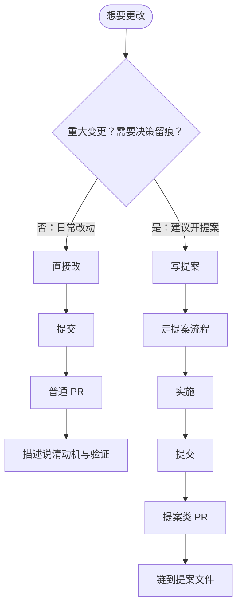
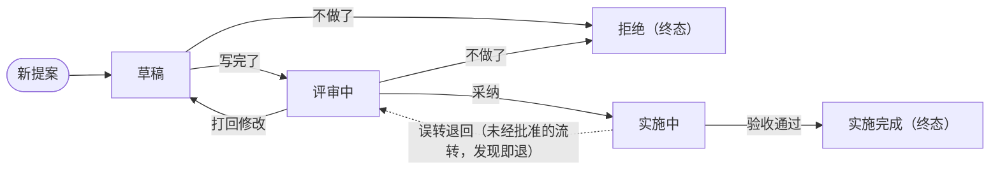

# 提案流程规范

## 要求

- **提案是可选工具，不是门禁**（2026-09-17 降级，原「任何变更必须提案」废止）：
  - 日常改动（修 bug、样式 / 文案调整、文档增补、小功能）**直接做**，不开提案
  - 重大变更**建议**走提案：结构 / 行为的大改、需要多轮讨论的设计、半年后还要回看「为什么这么定」的事——提案的价值在**决策留痕**，不在审批
  - 用不用提案由当次变更自行判断；拿不准时倾向不开，别让流程压过干活
- **已开提案的规矩不变**：五态状态机、流转记录、不可删除、`npm run check:proposals` 校验，全部照旧
- **文档自包含**：本文档不可外链其他文档，所有必要内容必须在本文档描述
- **提案不可删除**：提案一旦创建并提交远程后，就不可删除，只能通过状态流转来实现变更
- **规范的检查约束**：用 `npm run check:proposals` 校验已有提案的状态与目录一致性、流转合法性、记录完整性

## 豁免清单（已随 2026-09-17 降级废止，留档不删）

提案成为可选项后，「豁免」失去存在意义——所有改动本就可以不开提案，不存在「需要豁免才能改」的状态。原清单两条（提案体系自身的必要修订、收件箱条目的增删）被「提案可选」整体覆盖；本节保留只为说明这段历史，不再维护、不再新增条目。

## 概念描述

- 提交：就是 git 的 commit，一次变更可以包含多个提交。
- PR：一次变更就是一次 PR，分两种：
  - 普通 PR：不涉及提案的日常改动，描述里说清动机、变更与验证即可
  - 提案类 PR：包含开提案 / 改提案正文 / 状态流转的提交，描述中必须链到提案文件
  - 一个提案只对一个 PR，要是一个 PR 装不下，说明这个提案干的事太多，需要**拆提案**，不要拆 PR
  - 提案自身的创建、内容修改与状态流转都归该提案那个 PR（从落 `draft/` 起到实施完成，全在同一个 PR 里）

### 变更的流程

想改任何东西，先判断要不要提案，再按此流程：



### 是与不是

- **是**：
  - 提案是将要做的事的描述
  - 提案是决策过程的记录，包括为什么做、为什么不做等
  - 提案是做事方案的描述，包括验收标准、如何做等
- **不是**：
  - 提案不是项目设计和规范等常青文档，相反它的最终结论会写入这些常青文档
  - 提案不是代码，但是可以在实现方案中写一些代码

## 提案状态

| 状态   | 目录                             | 可流转到      | 含义         |
| ---- | ------------------------------ | --------- | ---------- |
| 草稿   | `docs/proposals/draft/`        | 评审中、拒绝    | 还在写，允许推翻重写 |
| 评审中  | `docs/proposals/review/`       | 草稿、实施中、拒绝 | 讨论与修改      |
| 实施中  | `docs/proposals/implementing/` | **实施完成**、评审中（仅限误转退回）  | 已批准，正在实现提案 |
| 实施完成 | `docs/proposals/done/`         | —         | **终态**     |
| 拒绝   | `docs/proposals/rejected/`     | —         | **终态**     |

### 状态流转



### 状态管理

- **目录即状态**：不同状态的提案分属不同文件夹（见上表「目录」列），状态流转就是移动文件；文件名用 kebab-case，如 `script-market.md`，不随状态变化改名
- **提案文档状态标记**：提案文档自身也需有状态标记，必须和所在目录对应；两者不一致时，**根据提案内容及时修改对齐**
- **流转记录**：提案文档需要记录自身的状态流转记录，且记录只增不减
- **状态变更**：
  - 状态变更只做两个动作
    - **移动文件**：把文件移动到目标状态的目录
    - **追加流转记录**：在提案末尾的流转记录**追加一行**
  - 与实现代码进同一个 PR 即可，commit 怎么划分不作要求（2026-09-17 移除原「必须单独 commit / 最后一个 commit / 禁 squash」约束——它要求靠 commit 顺序辨认流转动作，维护成本大于收益；流转记录表本身已是权威留痕）

### 流转示例

- 实施中发现设计有问题：把能做的做完，其余的开一个后续提案去修正
- 方案过时了：
  - 还没进终态（草稿 / 评审中）就**拒绝**它，再开后续提案
  - 已进终态（实施完成 / 拒绝）的提案是历史记录：不能拒绝，**正文也不改**，要修正就新开一个提案引用它
- 误转实施中（未获批准就做了采纳流转）：发现即退回评审中，流转记录如实记一笔「误转退回」；这条退路只为纠正操作失误存在，不能当作绕过评审的常规手段

## 提案结构

```markdown
# <标题>

> 状态：评审中
> 来源：<Issue 链接等，可空>
> 提案人：<GitHub 用户名等，可空>

## 问题

## 方案

## 备选方案

## 验收标准

## 不做的事

## 决策记录

| 日期 | 决策点 | 结论 | 依据（为什么这么定） |
| ---- | ------ | ---- | -------------------- |

## 流转记录

| 日期 | 从 → 到 | 理由（一句） | 关联 PR / Issue |
| ---- | ------- | ------------ | --------------- |
```

各字段要求：

- **标题**：提案的标题，必须简洁明了，不能超过 50 个字符
- **状态**：提案的状态，必须是状态表中的一个
- **来源**：提案的来源，可以是 Issue 链接，也可以为空
- **提案人**：提案的作者，可以是 GitHub 用户名，也可以为空
- **问题**：描述提案要解决的问题，只描述问题，不预设解法，必填
- **方案**：描述提案选了哪个做法，以及它怎么解决上面的问题，必填
- **备选方案**：描述提案考虑过但没选的，各自为什么输，必填
  - 为什么「备选方案」也是必填：记下被打败的决策，免得半年后会被重新论证一遍
- **验收标准**：描述提案要怎么验收，**写成可勾选的条目**，必填
- **不做的事**：本次范围外明确划掉的东西，必填
- **决策记录**：提案生命周期内逐个拍板的决策，**必填章节**
  - 创建时可只留表头
  - **只增不减**：决策不管决定还是被推翻时都增加新记录，不改旧行
  - 为什么记：半年后回看提案，最贵的不是「做了什么」，是「当时为什么这么定」
- **流转记录**：记录提案的状态流转，必填；
  - **提案创建时第一条为「新提案 → 草稿」**——从 0 到 1 也是一次流转
