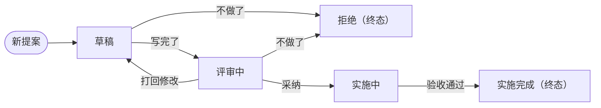

# 提案流程规范

## 要求

- **变更必须提案**：本仓库的**任何变更**都走提案流程
- **非提案的变更**：参照**豁免清单**
- **文档自包含**：本文档不可外链其他文档，所有必要内容必须在本文档描述
- **提案不可删除**：提案一旦创建，就不可删除，只能通过状态流转来实现变更
- **规范的检查约束**：用 `npm run check:proposals` 校验，违反上述规则的会被报出来

## 是与不是

- **是**：
  - 提案是将要做的事的描述
  - 提案是决策过程的记录，包括为什么做、为什么不做等
  - 提案是做事方案的描述，包括验收标准、如何做等
- **不是**：
  - 提案不是项目设计和规范等常青文档，相反它的最终结论会写入这些常青文档
  - 提案不是代码，但是可以在实现方案中写一些代码

## 提案状态

| 状态     | 目录                           | 可流转到           | 含义                 |
| -------- | ------------------------------ | ------------------ | -------------------- |
| 草稿     | `docs/proposals/draft/`        | 评审中、拒绝       | 还在写，允许推翻重写 |
| 评审中   | `docs/proposals/review/`       | 草稿、实施中、拒绝 | 讨论与修改           |
| 实施中   | `docs/proposals/implementing/` | **实施完成**       | 已批准，正在实现提案 |
| 实施完成 | `docs/proposals/done/`         | —                  | **终态**             |
| 拒绝     | `docs/proposals/rejected/`     | —                  | **终态**             |

### 状态流转



### 状态管理

- **目录即状态**：不同状态的提案分属不同文件夹（见上表「目录」列），状态流转就是移动文件；文件名用 kebab-case，如 `script-market.md`，不随状态变化改名
- **提案文档状态标记**：提案文档自身也需有状态标记，必须和所在目录对应；两者不一致时，**根据提案内容及时修改对齐**
- **流转记录**：提案文档需要记录自身的状态流转记录，且记录只增不减
- **状态变更**：
  - 状态变更只做两个动作
    - **移动文件**：把文件移动到目标状态的目录
    - **追加流转记录**：在提案末尾的流转记录**追加一行**
  - **必须单独一个 commit**
    - commit 里**不许夹带其他改动**（包括提案正文的修改）
    - 与 PR 关联
      - 实现提案的 PR 必须在描述里链到该提案文件
      - 一个 PR 可以有多个 **commit**，但最后一个 commit 必须是状态变更的 **commit**（因此这类 PR 禁止 squash merge，否则分不出 commit 顺序）

### 流转示例

- 实施中发现设计有问题：把能做的做完，其余的开一个后续提案去修正
- 方案过时了：
  - 还没进终态（草稿 / 评审中）就**拒绝**它，再开后续提案；
  - **已实施完成的不能拒绝**——原文不动，新开一个提案引用它

## 豁免清单

- **清单初始为空**：不预估哪些改动为非提案变更，只在遇到时记录
- **自身豁免**：新增清单条目不需要提案，防止自锁
- **清单复核**：为防止清单无限膨胀，需要定期复核，删除无用和冗余条目

| 改动类型 | 典型例子 | 为什么提案太重 |
| -------- | -------- | -------------- |
| —        | —        | —              |

## 提案结构

```markdown
# <标题>

> 状态：评审中
> 来源：<Issue 链接等，可空>
> 提案人：<GitHub 用户名等，可空>

## 问题

## 方案

## 备选方案

## 验收标准

## 不做的事

## 流转记录

| 日期 | 从 → 到 | 理由（一句） | 关联 PR / Issue |
| ---- | ------- | ------------ | --------------- |
```

各字段要求：

- **标题**：提案的标题，必须简洁明了，不能超过 50 个字符
- **状态**：提案的状态，必须是状态表中的一个
- **来源**：提案的来源，可以是 Issue 链接，也可以为空
- **提案人**：提案的作者，可以是 GitHub 用户名，也可以为空
- **问题**：描述提案要解决的问题，只描述问题，不预设解法，必填
- **方案**：描述提案选了哪个做法，以及它怎么解决上面的问题，必填
- **备选方案**：描述提案考虑过但没选的，各自为什么输，必填
  - 为什么「备选方案」也是必填：记下被打败的决策，免得半年后会被重新论证一遍
- **验收标准**：描述提案要怎么验收，**写成可勾选的条目**，必填
- **不做的事**：本次范围外明确划掉的东西，必填
- **流转记录**：记录提案的状态流转，必填
